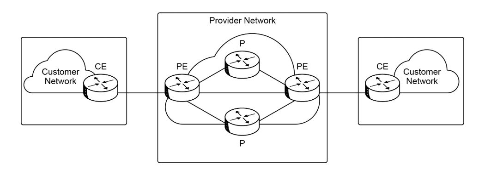

# 🛰️ MPLS Layer 3 VPN

## Introduction
MPLS Layer 3 VPNs enable service providers to offer scalable and secure IP connectivity to multiple customer sites over a shared MPLS backbone. They combine MPLS forwarding with BGP-based routing to efficiently manage customer routes and traffic isolation across the provider network.

# Core Technologies
Layer 3 MPLS VPN relies on two core technologies:
- **MPLS**: For forwarding packets through the core network.
- **BGP**: For exchanging customer routes.

# MPLS VPN Architecture

## Customer Network
This is the customer-controlled domain.
- **CE (Customer Edge) Router**: Located at the edge of the customer network with direct connectivity to the provider network.

## Provider Network
This is the provider-controlled domain consisting of **PE** and **P** routers.
- **PE (Provider Edge) Router**: Located at the edge of the MPLS service provider cloud, connected to CE routers and provider routers (P routers).
- **P (Provider) Router**: Located in the core of the provider network, interconnecting PE routers and other P routers.

# Routing Protocols at the PE-CE

## Common Routing Protocols Used at the PE-CE

### EIGRP
- Same Autonomous System (AS) configuration.
- Different AS scenario.
- Backdoor link for redundancy.

### OSPF
- General implementation considerations.
- Usage of Backdoor Link and Sham Link to optimize path selection.

### MP-BGP
- Single AS for all customer sites.
- Different unique AS numbers for each site (recommended for isolation).
- Backdoor link considerations.

# Service Provider Responsibilities
The service provider is responsible for:
- Transferring customer routes between locations.
- Forwarding IP packets between locations.

# Disadvantages
- **Service provider dependency**: Changing providers requires complete routing reconfiguration on the organization's edge network.
- **Routing convergence and reliability are out of customer control**: The service provider controls the core network.

# Summary
- The **customer and service provider** must agree on **IGP parameters** between CE and PE routers.
- **CE routers** only peer with **PE routers** outside their own site.
  - CE routers do **not** peer with other CE routers across the provider network.
- The **service provider uses BGP** to transfer routes received from CE routers to other locations:
  1. Routes received from the IGP with the client are redistributed into BGP.
  2. These routes are carried to other PE routers using **MP-BGP** (Multiprotocol BGP).
  3. Finally, routes are redistributed from MP-BGP back into the IGP on the PE router connected to the destination CE router.

---

### 📚 Navigation
- → Next: [Enterprise-Managed VPNs](enterprise-managed-vpns.md)  
- ← Previous: [WAN Overview](wan-overview.md)  
- ↑ Back to: [WAN Technologies](../06-wan/readme.md)

---

### 📚 Navigation
- → Next: [Enterprise Managed VPNs](enterprise-managed-vpns.md)  
- ← Previous: [Layer 2 VPN](l2-vpn.md)
- ↩ Return to: [WAN - Index](../README.md)

